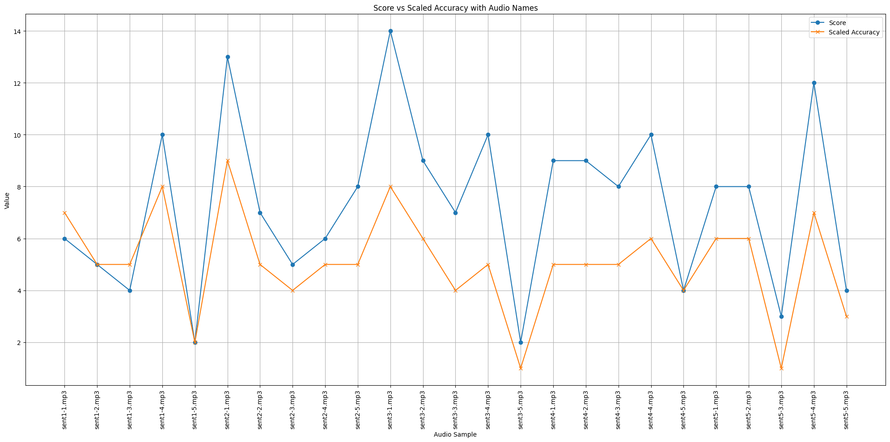

- The `ei` project includes several scripts, algorithms, and metrics to score elicited imitation.

# Metrics:

## Needleman-Wunsch algorithm

- To be documented.

## Sentence Transformers

- To be documented.

## Edit Distance

- To be documented.

# Automatic Speech Recognition:

- To be documented.

# EI User Interface:

### Some Results:

